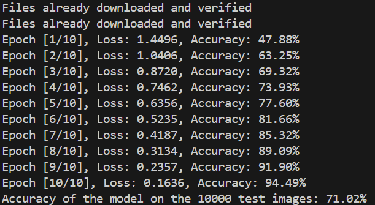
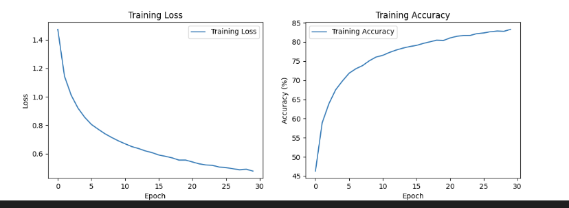

## 基础任务  
1.计算机对图像的存储以及处理  
**数组**：二维数组用于灰度图像，每个元素代表一个像素的亮度；三维数组用于彩色图像(如RGB)，包含亮度，宽度和通道(如红，绿，蓝三个通道)  
**矩阵**：图像的每个像素值被组织成矩阵格式，以便进行各种数学运算和处理  
**张量**：在深度学习框架中，图像通常表示为张量，以便进行多维运算，适合于神经网络的输入  
**图像文件格式**：PNG等，一般在内存中才会转换成这种数据结构  
2.有关卷积神经网络层的一些简单理解  
输入层和输出层不必过多说明  
**卷积层**：通过卷积核在图像上滑动做点积来处理图像，提取图像特征  
**池化层**：降低特征图的维度，减少计算量，控制过拟合。比如一个32 x 32的图像，经过最大池化层(kernel_size=2,stride=2)处理后就变成了16 * 16实现了降维  
**全连接层**：每个神经元与前一层的每个神经元都有连接，适合于分类任务的最后一层  
3.过拟合与欠拟合  
**欠拟合**：模型在训练数据上表现不佳，无法捕捉数据的基本模式或特征  
可能原因：模型太简单；训练不充分；特征选择不当，重要特征未被纳入模型  
**过拟合**：模型在训练数据上表示良好，但在未见数据(测试数据)表现不佳  
可能原因：模型过于复杂，以至于记住了训练数据中的噪声和异常值，而不是学习到一般化的特征；训练数据量不足，模型在有限数据上过度拟合；特征工程不当，引入过多无关或冗余的特征  

## 实操  
在了解完卷积神经网络后，我开始了task2，不得不说，框架都给完了，确实好写太多了，考虑到只是一个图像分类问题，于是我只设置了两层卷积层，在将代码补全之后，我开始运行却出现了一个错误：  
报错内容：x = x.view(batch_size, 64 * 8 * 8)  # 将四维张量转换为二维张量
RuntimeError: shape '[64, 4096]' is invalid for input of size 65536，即新形状张量数量与原始张量数量不匹配  
解决：最后发现是自己太蠢了，自己只大概了解了view是干嘛的，以为固定填的是batch_size，后面问ChatGpt让我改成-1可以自动计算另外一个维度，虽然他没解释为啥，但是我觉得应该是训练集在分批次时，因为只有5000个数据在最后一批时数据只有16个，而不是batch_size=64，所以才会出现数量不相等  
最后，附上我的程序运行结果：  
  
可以发现的是，模型在训练集效果很好，从47%到94%，说明模型已经逐渐掌握了数据特征，但是，测试集的准确率仅仅只有71%，完蛋，可能出现过拟合了，具体为什么以及我的解决方案，请到进阶任务查看  

## 进阶任务  
首先，我查阅资料以及询问GhatGPT知道了一些解决过拟合的常见方法：增加训练数据，使用动态学习率，简化模型，正则化，早停法等，但因为时间有限(其实是我的了解有限，bushi)，我就从增加训练数据开始一步步优化我的程序，但最后也没能收获很好的效果

1.增加训练数据：包括数据增强以及收集更多数据(显然不可能)，于是我采用了数据增强的方法，采用了随机裁剪，随机水平翻转

需要注意的是，一开始我以为直接在transform添加这些语句就好了，后面查阅资料发现只需要对训练集应用，目的增加样本的多样性，使模型适应不同的输入变化，减少过拟合，而测试集只需要标准化，因为测试集是用来评估模型性能的，应保证原图像的完整度，标准化使得输入数据与训练数据的一致性更高，另外就是我发现画出来的图线并没有接近平缓，所以我增加了训练轮数，在这样做了之后，测试集的准确率提高到了80.73%但是训练集的准确率却降到了82.79%，我还尝试了dropout正则化，结果准确率不升反降，我就抛弃这个想法了

2.后面我看折线图在20-25轮训练时出现了波动，准确率还存在下降现象，于是我想到了使用学习率调度器，一开始用了ReduceLROnPlateau，但是没想到准确率不升反降，我也不知道为什么(啊啊啊)，后面我又尝试StepLR，测试集准确率80.05%，训练集准确率81.77%，但依旧没有不使用时高，但是我看折线图好像还有上升趋势，所以我在想是不是我训练轮数还不够，所以我把训练轮数从25变到了30，得到训练集准确度82.24%，测试集准确度79.9%(ok,是我想多了)

3.最后我又尝试了一个我比较感兴趣的方法--早停法，但是结果却不如人意，训练集准确率81.7%，测试集准确率77.87%

虽然最后也没能够将准确率提高很多，我优化程序的方法也很无脑，只知道可能是出现过拟合问题，就一个个尝试解决过拟合的方法，因为以我现在的水平我还不知道到底在什么情况下选择哪一个具体的方法，还有很多方法我也没有去尝试，像替换更复杂的模型之类的，现在我也就知道最基础的卷积神经网络模型，只能说我只将一只脚踏进了及其学习的大门，还有很多未知的事物等着我去探索，但是我也很开心能够提高准确率，每次解决时都在期待，虽然有时会比较落寞，但总有些结果是很好的，另外就是对于可视化还是蛮简单的，下面附上我的图：

进阶任务就到这啦，没能很好的完成，孩子尽力了(另外就是，我有一个问题，我在进行测试的时候发现，同一个代码为什么我第一次运行是一个结果，而我想再运行时有时另外一个结果，虽然两次结果准确率相差不大，但我还是很好奇原因）(如果我有面试的机会，面试的时候能告诉我吗？如果我被pass掉了，能够邮箱回复我吗)（别问我为啥这么做，当然是为了引起学长学姐的注意啦，bushi）
